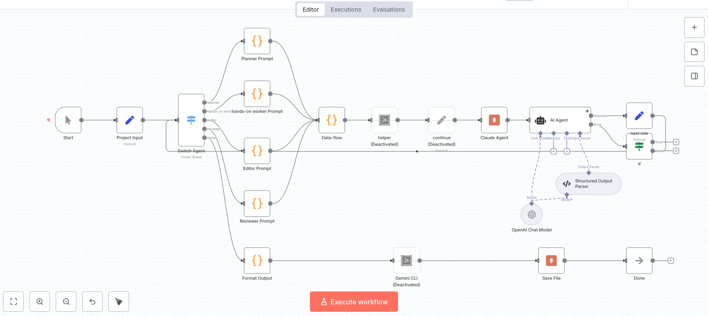
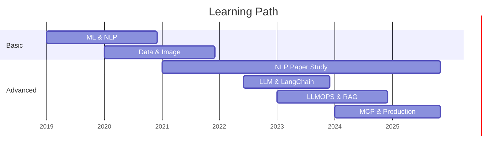

  
  # README
  

Impact를 위해 일하는 AI 실무자   
RAG 시스템부터 멀티에이전트까지 - 기술이 필요한 곳에

   

  
  

  
멀티 에이전트 개발 시스템 - 디렉션을 계획부터 검증까지 알아서 시행합니다.
 

## 🌍 Why I Code

**"좋은 기술은 필요한 사람에게 닿을 때 가치를 만듭니다."**
저는 조해창입니다. 세상에 대한 의문과 갈길을 찾아서 물리학을 전공했습니다. 흘러가다 보니 배운 컴퓨터와 인공지능은 제 관심을 사로잡았고, 지금은 세상의 관심을 사로잡고 있습니다.   
AI 연구 커뮤니티에서 사회혁신 프로젝트를 기획하고 운영하며, 기술이 실제 문제를 해결하는 과정을 경험했습니다.

- **케어링노트** - 독거노인 복약상담 앱 (약사 봉사 디지털화)
- **An eye LAB** - 인도 백내장 진단 앱 (의료 접근성)
- **이을LAB** - 지역소멸 대응 게임 앱 (직접 기획 & 구성)

**커뮤니티 오케스트레이션:**
- Tech for Impact 연구 LAB 직접 기획 및 설계
- 커뮤니티에 참여하여 직접 연구활동 진행
- GPU 서버 인프라 운영으로 AI 논문 성과 지원
- 100+ 연구원들의 임팩트 프로젝트 참여 환경 조성

 

## 🛠️ Tech Stack

| AI/ML | Backend & Data | Frontend | Infrastructure | Automation |
| :---: | :---: | :---: | :---: | :---: |
|  |  |  |  |  |
|  |  |  |  |  |
|  |  | |  | |
|  |  | |  | |

 

## Key Projects

| Project | Problem & Solution | Impact | Tech Stack |
| :--- | :--- | :--- | :--- |
| **1. RAG 기반 커뮤니티 Q&A 봇** | **P**: 신규 멤버 반복 질문 **S**: 맥락 기반 자동 응답 시스템 | 주말 대응 가능 즉시 응답 시스템 구축 | Python, RAG, LangChain, Vector DB |
| **2. GPU 서버 인프라 복구** | **P**: 서버 고장으로 연구 중단 **S**: 서버 복구 및 API 접근 전환 | 3개월 내 사용률 100% 논문 성과 지원 | Linux, Docker, K8s, GPU Server |
| **3. n8n 멀티에이전트 & 커뮤니티 호스팅** | **P**: 반복 업무 및 자동화 도구 니즈 **S**: K8s 기반 n8n 서버 호스팅 및 워크플로우 구축 | 커뮤니티 멤버 사용 환경 제공 사내 업무 자동화(수작업 70% ↓) | n8n, Kubernetes, MCP, LLM API |
| **4. Tech for Impact LAB** | **Role**: AI 커뮤니티-사회혁신 연결 **Act**: LAB 기획, 인재 매칭 | 케어링노트, 이을LAB 등 임팩트 프로젝트 배출 | Community Building, Tech Leadership |

 

## Core Competencies

- **AI System Development**: RAG 기반 Q&A, 멀티에이전트 시스템, LLM 활용 강의 (삼성, LG 등)
- **Infrastructure**: GPU 서버 복구 및 운영, Kubernetes 고가용성 배포
- **Full-Stack**: React, Django, FastAPI, Data Analysis (Pandas, NumPy)

 

## 🎓 Teaching & Writing

 <strong>강의 및 저술 활동 자세히 보기</strong>

### 강의 (AI 실무 중심)
- **LangChain/LangGraph 전문 강의** - 삼성전자, LG전자, 광주 AI 사관학교
- **데이터 분석 실무** - 재직자 대상 (Pandas, NumPy, 시각화)
- **코딩 테스트 고급** - 알고리즘 문제 해결 및 최적화
- **React + Django 풀스택** - 프론트엔드/백엔드 통합 과정
- **이화여대, 단국대** - 바이브코딩 수업
- **Build with AI 해커톤** - Google 공동 주최 세미나

### 저술
- 📚 **『이미지처리 바이블』** - 집필
- 📚 **『ChatGPT의 원칙과 실습』** - 번역

 

## Learning Timeline

 

## 📈 GitHub Stats

<table>
  <tr>
    <td></td>
    <td></td>
  </tr>
</table>

 

  
  💬 *"좋은 기술은 필요한 사람에게 닿을 때 가치를 만듭니다."*

